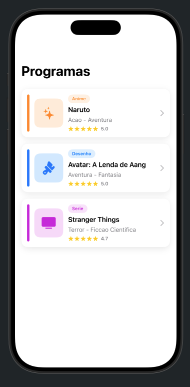
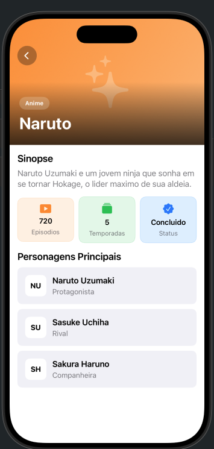
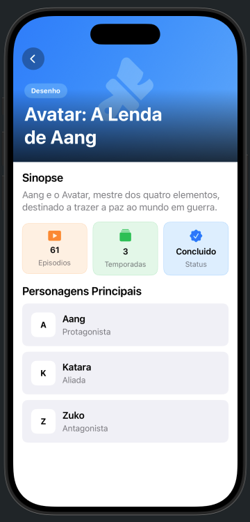
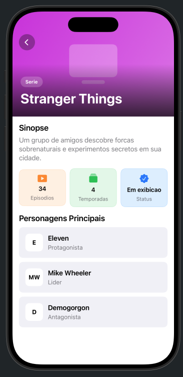

# Ponderada SwiftUI

## Membros: [Bruno Fabiani](https://github.com/Fabiani359278) e [Marcelo Conde Filho](https://github.com/Melomm)

Este projeto implementa uma atividade de SwiftUI com uma lista de programas e uma tela de detalhes para cada item.

A tela inicial mostra três programas: Naruto, Avatar: A Lenda de Aang e Stranger Things. Cada card apresenta o tipo, nome, gênero, avaliação e um ícone visual. Ao tocar em um card, o app abre a tela de detalhes do programa selecionado.

Foram criados componentes reutilizáveis para evitar repetição de layout:

- `ShowCard`: card usado na tela principal.
- `InfoBadge`: bloco de informação usado na tela de detalhes.
- `CharacterRow`: linha usada para mostrar os personagens principais.

A tela de detalhes contém uma área hero com cor baseada no tipo do programa, ícone grande, gradiente, badge de tipo, título e botão de voltar customizado. Abaixo dela aparecem a sinopse, as informações principais e a lista de personagens.

O foco do projeto foi praticar `NavigationStack`, `VStack`, `HStack`, `ZStack`, componentes reutilizáveis e organização de dados em um modelo simples.

## Ir alem

Nos resolvemos seguir o caminho de "ir alem" proposto na atividade.

Em vez de criar uma tela separada para cada programa, foi criada uma unica tela reutilizavel: `ProgramaDetailView(programa:)`. Essa tela recebe os dados do programa selecionado e monta o detalhe dinamicamente.

A `ListaView` tambem usa um array de programas com `ForEach`, evitando repeticao de codigo e deixando o projeto mais facil de manter caso novos programas sejam adicionados.

## O que foi feito em cada arquivo

### ProgramasApp.swift

Este arquivo e o ponto de entrada do aplicativo. Ele inicia o app e define que a primeira tela exibida sera a `ListaView`.

### ListaView.swift

Este arquivo monta a tela principal. Ele cria uma lista com os tres programas, usa `NavigationStack` para permitir navegacao e gera os cards com `ForEach`. Cada card abre a `ProgramaDetailView` com os dados do programa escolhido.

### ProgramaDetailView.swift

Este arquivo monta a tela de detalhes. Ele recebe `Programa` como parametro e reutiliza o mesmo layout para todos os programas. A tela tem uma area hero no topo, botao de voltar customizado, sinopse, badges de informacoes e lista de personagens.

### ShowCard.swift

Este componente representa cada card da tela principal. Ele mostra a barra lateral colorida, thumbnail com icone, tipo, nome, genero, avaliacao por estrelas e o chevron indicando navegacao.

### InfoBadge.swift

Este componente mostra uma informacao curta dentro da tela de detalhes. Ele foi usado para episodios, temporadas e status, mantendo o mesmo visual para os tres blocos.

### CharacterRow.swift

Este componente mostra uma linha de personagem. Ele exibe um identificador visual, o nome e o papel do personagem dentro da historia.

## Screenshots

### Tela principal

### Detalhe - Naruto

### Detalhe - Avatar

### Detalhe - Stranger Things

